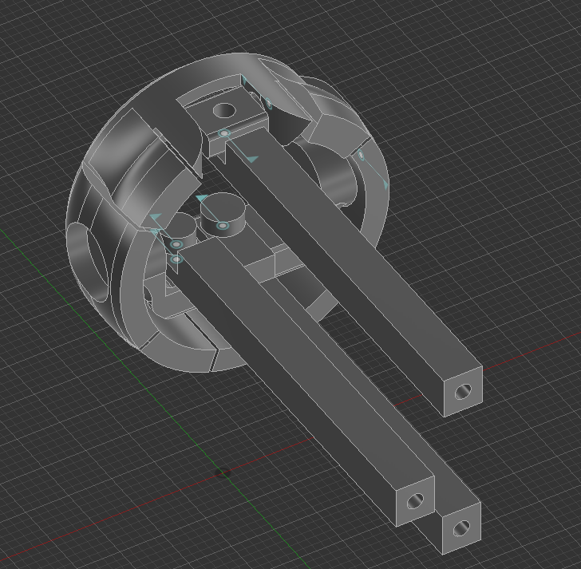

# March 20 2026: Started making the eyeball
so today i started making the eyeball, since im gonna make the eye system, then the mouth and then ears, then neck and etc. the eyeball is pretty simple, its smtn like [this](https://www.youtube.com/watch?v=ihXxbQefl1c&list=WL&index=3&t=589s). so i have to custom design the eye and the adapter. this system is very effective, and compact. 

[insert pictures of what you're working on!]

https://lapse.hackclub.com/timelapse/bPD6VYQ9OHWk \
https://lapse.hackclub.com/timelapse/R3avVUUkZ5Qu \
**Total time spent: 45 mins**

# March 21, 2026: Made eyeball snapfit.
so i tried to make the eyeball snapfit. ill have to print them now. so ill print and then check the results.
 \
after this ill ahve to make the main system, ill add joitns in fusion to make it more understandable.

### 9:43 pm

so i made the things that go to servo. and i also made the fusion joint. i think ima have some problem with the fixed thng at the middle and the moving part right next to it, idk. and lol just as im writing this the print finished, lemme go check. so thrs alotta issues.. so first of all the up thingey is hard to get in, and the thing that supports it is very brittle. then the main adapter is hard to get in as well, and the other part in the adapter is very loose. im so bad at designing lol. ill fix these rn.

https://lapse.hackclub.com/timelapse/Nn3NmJtqSQf6
https://lapse.hackclub.com/timelapse/R2DGub7P9Jni
**Total time spent: 45 mins**